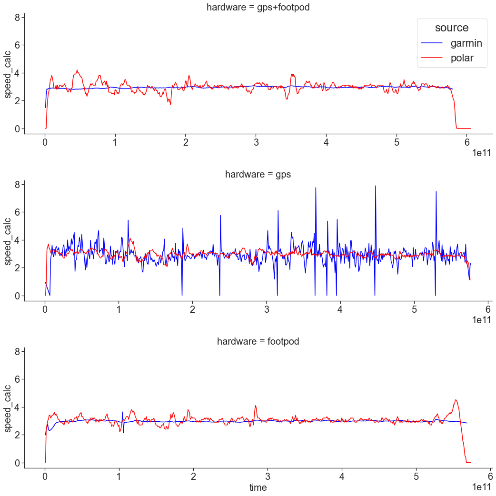
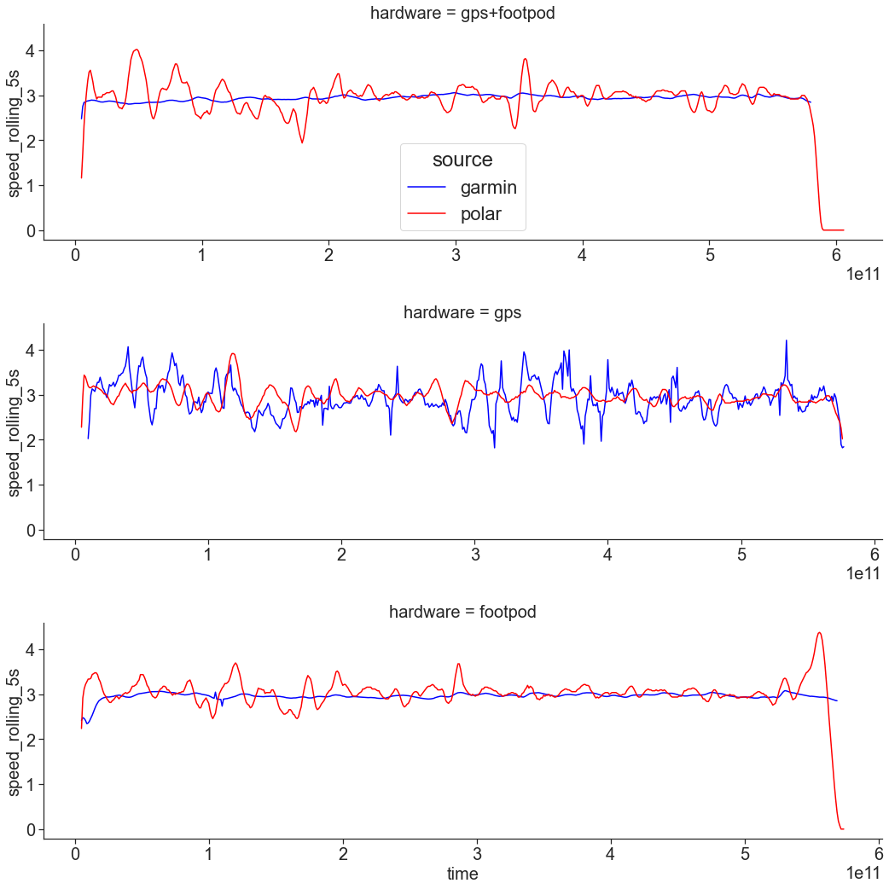

GPS, footpod, and accuracy
======================

<!-- TOC START min:1 max:6 link:true asterisk:false update:true -->
- [GPS alone vs GPS with footpod](#gps-alone-vs-gps-with-footpod)
  - [Track](#track)
  - [Hardware](#hardware)
  - [Results: distance](#results-distance)
  - [Results: speed variation during the run](#results-speed-variation-during-the-run)
<!-- TOC END -->

# GPS alone vs GPS with footpod

## Track

Track distance: 1.71km +- 0.01km (3x measurements with garmin vista hcx and polar m 400 = 6 measurements), urban environment.

## Hardware

Hardware:
- Garmin Forerunner 945 (GPS+Glonass, 1s track saving)
  - adidas Mi_coach footpod (ant+ version)
- Garmin Vista HCx (as reference)
- Polar M400 (as reference)

## Results: distance

tl;dr garmin with footpod measured almost the exact distance of the loop (1.71 km).

Three runs with three settings of garmin forerunner: (1) GPS+footpod, (2) GPS only, and (3) footpod only. All runs accompanied with two other gpses as a reference. Track distance: 1.71 +- 0.01.

| Round | distance Polar (reference) | distance Vista (reference) | data source | distance | time   | average pace | error  | place |
| ----- | -------------------------- | -------------------------- | ----------- | -------- | ------ | ------------ | ------ | ----- |
| 1     | 1.72                       | 1.70                       | GPS+footpod | 1.71     | 9:40.5 | 05:40        | -0.10% | 1 🥇  |
| 2     | 1.70                       | 1.71                       | GPS         | 1.67     | 9:31.8 | 05:43        | 2.24%  | 3     |
| 3     | 1.72                       | 1.70                       | footpod     | 1.68     | 9:28.7 | 05:38        | 1.66%  | 2     |

- garmin with footpod measured almost the exact distance of the loop (1.71 km, -0.10%).
- garmin with gps only was the worst, with error +2.24%
- foot pod only (no GPS!) was 1.66% wrong

## Results: speed variation during the run

tl;dr: garmin+footpod offers more "stable" and consistent pace/speed

Raw data plots. Garmin device + polar m400 as reference.

Smoothened data (5s window average). Garmin device + polar m400 as reference.

- garmin with footpod: very stable pace.
- garmin with gps only: high variability of speed
- foot pod only (no GPS!): very stable pace.
- polar m400: pace is more stable than forerunner in gps-only mode. This may be due to averaging [citation needed].
