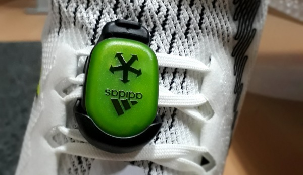
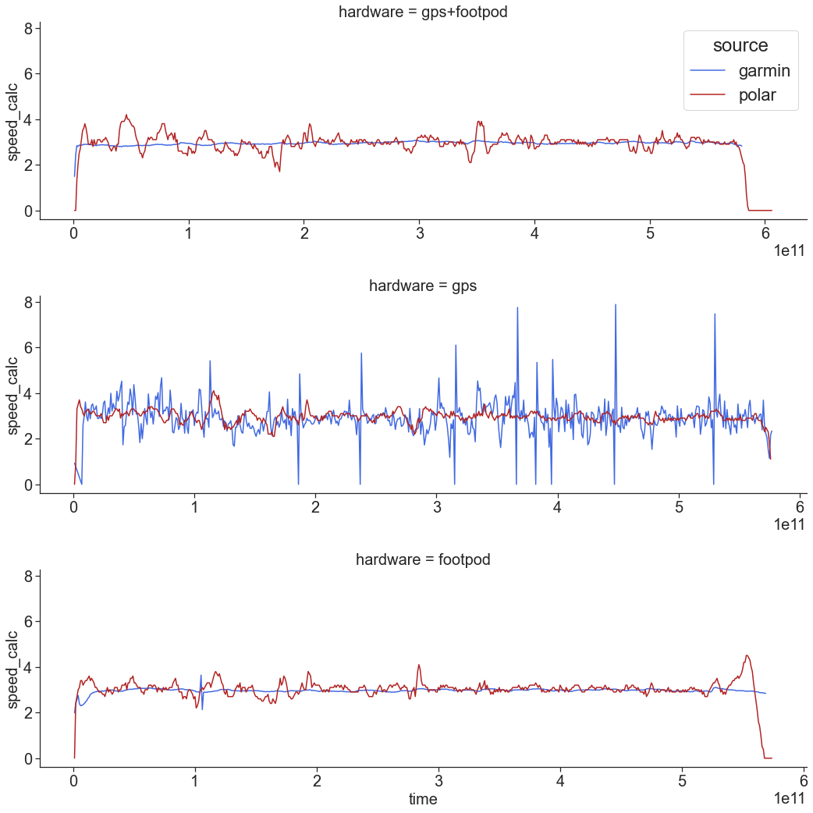
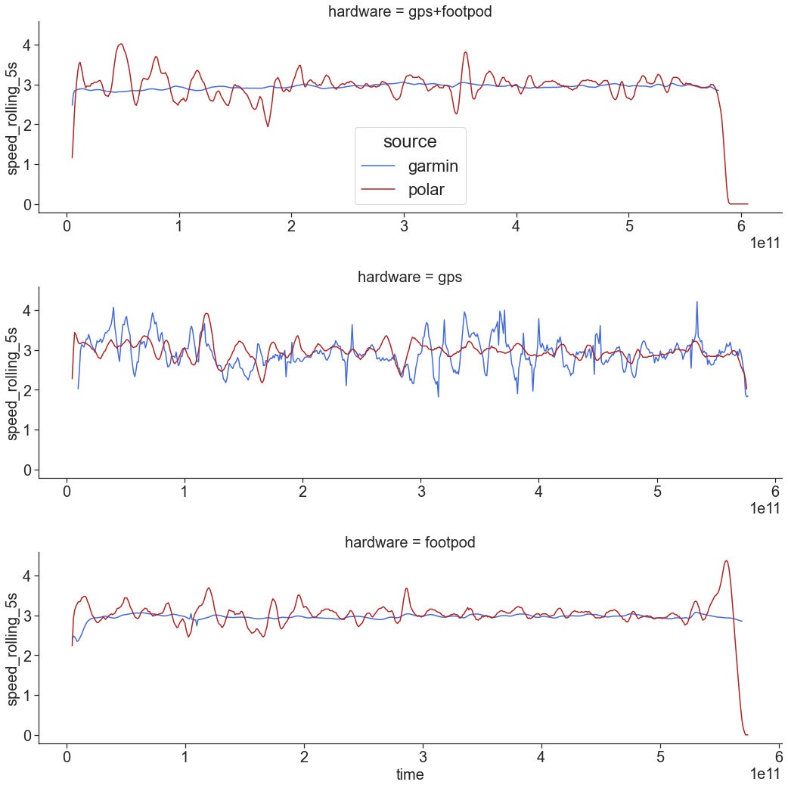
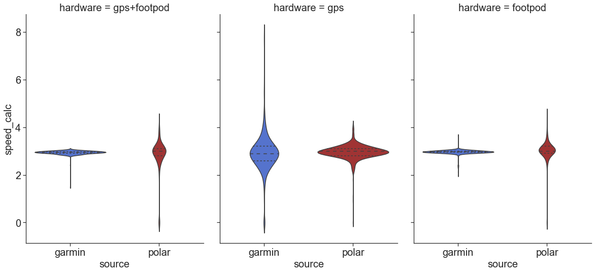

GPS, footpod, and accuracy
======================

<!-- TOC START min:1 max:6 link:true asterisk:false update:true -->
- [GPS alone vs GPS with footpod](#gps-alone-vs-gps-with-footpod)
  - [Track](#track)
  - [Hardware](#hardware)
  - [Results: distance](#results-distance)
  - [Results: speed variation during the run](#results-speed-variation-during-the-run)
<!-- TOC END -->

# GPS alone vs GPS with footpod

**tl;dr: footpod increases the distance measurement accuracy of the gps sportwatch.**

## Track

Track distance: 1.71km +- 0.01km (3x measurements with garmin vista hcx and polar m 400 = 6 measurements), urban environment.

## Hardware

Hardware:
- Garmin Forerunner 945 (GPS+Glonass, 1s track saving)
  - adidas Mi_coach footpod (ant+ version)
- Garmin Vista HCx (as reference)
- Polar M400 (as reference)

## Results: distance

tl;dr garmin with footpod measured almost the exact distance of the loop (1.71 km).

Three runs with three settings of garmin forerunner: (1) GPS+footpod, (2) GPS only, and (3) footpod only. All runs accompanied with two other gpses as a reference. Track distance: 1.71km +- 0.01km.

| Round | distance Polar (reference) | distance Vista (reference) | data source | distance | time   | average pace | error  | place |
| ----- | -------------------------- | -------------------------- | ----------- | -------- | ------ | ------------ | ------ | ----- |
| 1     | 1.72                       | 1.70                       | GPS+footpod | 1.71     | 9:40.5 | 05:40        | -0.10% | 1 🥇  |
| 2     | 1.70                       | 1.71                       | GPS         | 1.67     | 9:31.8 | 05:43        | 2.24%  | 3     |
| 3     | 1.72                       | 1.70                       | footpod     | 1.68     | 9:28.7 | 05:38        | 1.66%  | 2     |

- garmin with footpod measured almost the exact distance of the loop (1.71 km, -0.10%).
- garmin with gps only was the worst, with error +2.24%
- foot pod only (no GPS!) was 1.66% wrong

## Results: speed variation during the run

tl;dr: garmin+footpod offers more "stable" and consistent pace/speed

Raw data plots. Garmin device + polar m400 as a reference.

Smoothened data (5s window average). Garmin device + polar m400 as reference.

Distribution of speeds:

And some statistics:

<table border="1" class="dataframe">
  <thead>
    <tr>
      <th></th>
      <th></th>
      <th colspan="8" halign="left">speed_calc</th>
    </tr>
    <tr>
      <th></th>
      <th></th>
      <th>count</th>
      <th>mean</th>
      <th>std</th>
      <th>min</th>
      <th>25%</th>
      <th>50%</th>
      <th>75%</th>
      <th>max</th>
    </tr>
    <tr>
      <th>hardware</th>
      <th>source</th>
      <th></th>
      <th></th>
      <th></th>
      <th></th>
      <th></th>
      <th></th>
      <th></th>
      <th></th>
    </tr>
  </thead>
  <tbody>
    <tr>
      <th rowspan="2" valign="top">footpod</th>
      <th>garmin</th>
      <td>569.0</td>
      <td>2.958910</td>
      <td>0.105325</td>
      <td>1.99</td>
      <td>2.940002</td>
      <td>2.960083</td>
      <td>3.000000</td>
      <td>3.639984</td>
    </tr>
    <tr>
      <th>polar</th>
      <td>574.0</td>
      <td>2.999651</td>
      <td>0.492067</td>
      <td>0.00</td>
      <td>2.900024</td>
      <td>3.000000</td>
      <td>3.199951</td>
      <td>4.500000</td>
    </tr>
    <tr>
      <th rowspan="2" valign="top">gps</th>
      <th>garmin</th>
      <td>572.0</td>
      <td>2.917657</td>
      <td>0.770542</td>
      <td>0.00</td>
      <td>2.580013</td>
      <td>2.894989</td>
      <td>3.209970</td>
      <td>7.880005</td>
    </tr>
    <tr>
      <th>polar</th>
      <td>576.0</td>
      <td>2.957465</td>
      <td>0.302476</td>
      <td>0.00</td>
      <td>2.800049</td>
      <td>3.000000</td>
      <td>3.099998</td>
      <td>4.100006</td>
    </tr>
    <tr>
      <th rowspan="2" valign="top">gps+footpod</th>
      <th>garmin</th>
      <td>580.0</td>
      <td>2.940086</td>
      <td>0.085252</td>
      <td>1.49</td>
      <td>2.910004</td>
      <td>2.949951</td>
      <td>2.980042</td>
      <td>3.070007</td>
    </tr>
    <tr>
      <th>polar</th>
      <td>606.0</td>
      <td>2.852475</td>
      <td>0.672028</td>
      <td>0.00</td>
      <td>2.799988</td>
      <td>3.000000</td>
      <td>3.100002</td>
      <td>4.199997</td>
    </tr>
  </tbody>
</table>

**Results:**

- garmin with footpod: very stable pace.
- garmin with gps only: high variability of speed
- foot pod only (no GPS!): very stable pace.
- polar m400: pace is more stable than forerunner in gps-only mode. This may be due to averaging [citation needed].
